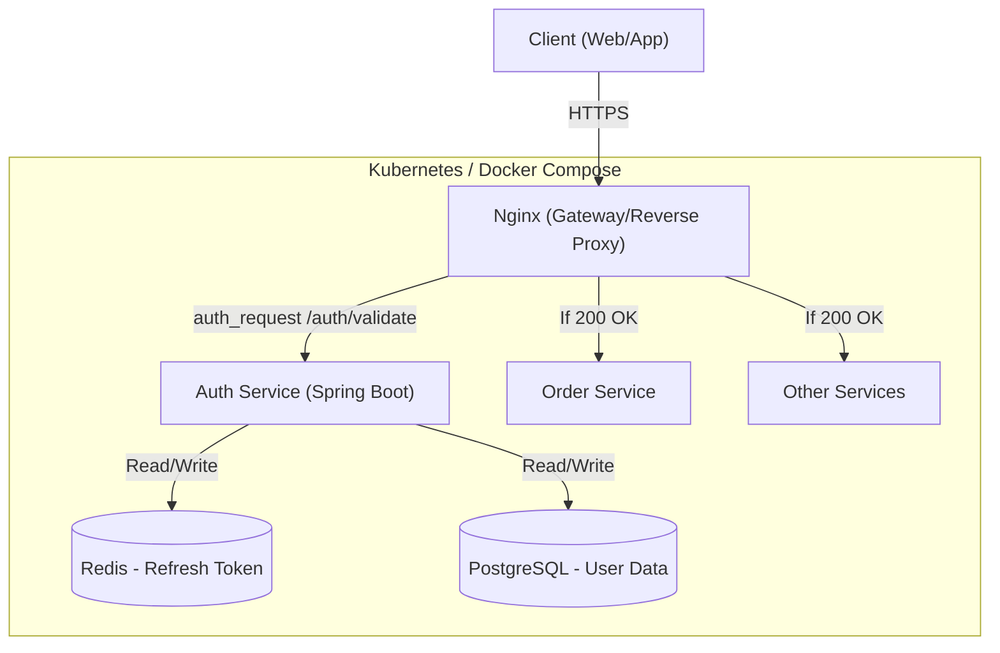
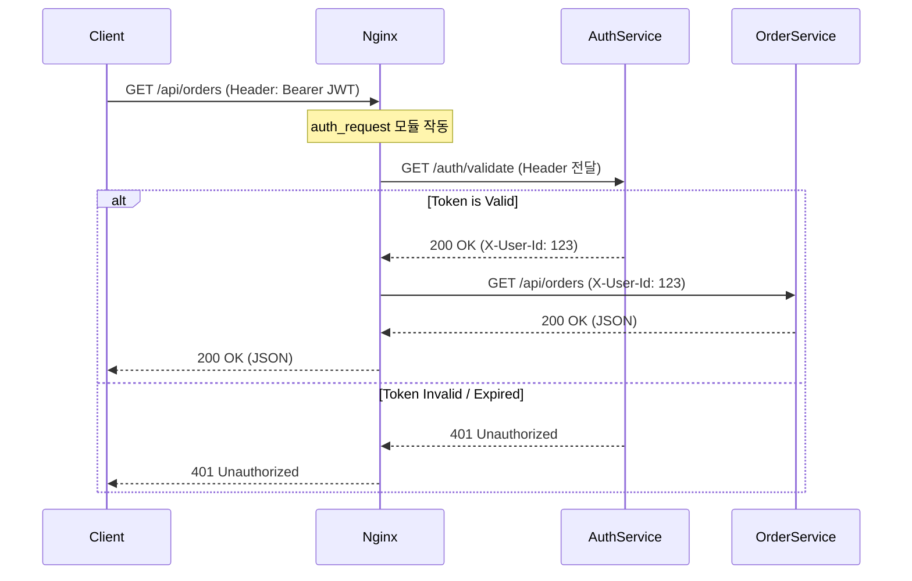
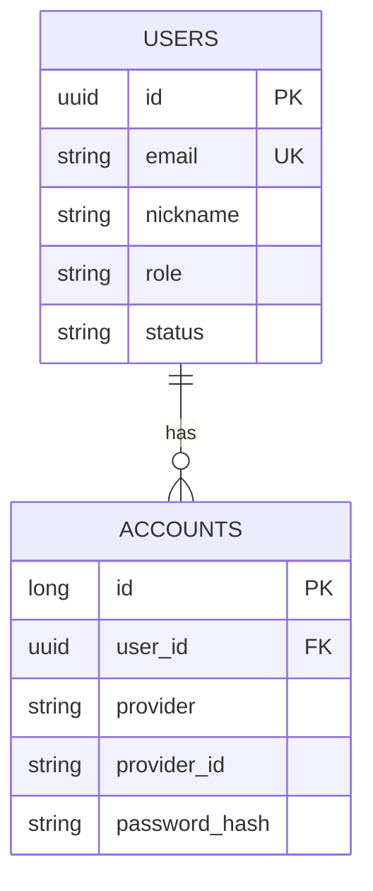

# Authentication Module Development Specification

## 1. 개요 (Overview)
### 1.1 목표
- Java 17 및 Spring Boot 3.x 기반의 인증(Authentication) 모듈 개발.
- MSA 환경 및 Minikube 배포를 고려한 Stateless 아키텍처 설계.
- **Nginx `auth_request`** 모듈을 활용한 중앙 집중식 인증 처리.

### 1.2 범위 (Scope)
- **포함:** 회원가입, 로그인(JWT 발급), 로그아웃(Blacklist), 토큰 재발급, 토큰 검증 API(`/validate`), 내 정보 조회.
- **미포함:** 비즈니스 로직(주문, 결제 등), 소셜 로그인(초기 범위 제외, 추후 확장).

---

## 2. 시스템 아키텍처 (System Architecture)

### 2.1 전체 구조도
Nginx가 게이트웨이로서 모든 요청을 받아 인증 서버에 검증을 위임하는 구조입니다.

### 2.2 인증 시퀀스 (Authentication Flow)
사용자가 보호된 리소스(예: 주문 내역)에 접근할 때의 흐름입니다.

---

## 3. 기능 요구사항 (Functional Requirements)

### 3.1 사용자 (User)
1. **회원가입:** 이메일, 비밀번호(BCrypt 암호화), 이름 저장.
2. **로그인:** 성공 시 Access Token(응답 바디) 및 Refresh Token(Redis 저장) 발급.
3. **로그아웃:** Redis에서 Refresh Token 삭제 및 Access Token을 Blacklist에 등록(선택 사항).
4. **토큰 검증 (Internal):** Nginx가 호출할 `/validate` 엔드포인트 제공. (유효 시 200 OK, 무효 시 401).

---

## 4. 기술적 설계 (Technical Design)

### 4.1 기술 스택 (Tech Stack)
- **Language:** Java 17
- **Framework:** Spring Boot 3.x (Spring Security 6.x)
- **Build Tool:** **Gradle (Kotlin DSL)**
- **Database:** **PostgreSQL 15** (Docker)
- **Cache:** **Redis** (Docker) - Refresh Token 저장소
- **Auth Library:** `jjwt` (Java JWT)

### 4.2 데이터 모델 (Schema)

**ERD (Entity Relationship Diagram)**

### 4.3 API 명세 (API Specification)

| Method | URI | Description | Auth Required | Note |
|--------|-----|-------------|---------------|------|
| POST | `/api/v1/auth/signup` | 회원가입 | X | |
| POST | `/api/v1/auth/login` | 로그인 | X | Returns Access & Refresh Token |
| POST | `/api/v1/auth/refresh` | 토큰 갱신 | X | Requires Refresh Token |
| GET | `/api/v1/auth/validate` | **토큰 검증** | O | **Nginx 전용 (Internal)** |
| GET | `/api/v1/users/me` | 내 정보 조회 | O | |

---

## 5. 구현 계획 (Implementation Plan)
1. **인프라 구성:** `docker-compose.yml` 작성 (PostgreSQL, Redis).
2. **프로젝트 초기화:** Spring Boot 프로젝트 생성 (Gradle, Web, Security, JPA, Redis).
3. **도메인 개발:** User/Account Entity 및 Repository 구현.
4. **JWT 모듈 개발:** TokenProvider (생성, 검증, 파싱) 구현.
5. **Security 설정:** `SecurityConfig` (Stateless 설정, PasswordEncoder).
6. **비즈니스 로직:** AuthService (가입, 로그인, 검증).
7. **컨트롤러 개발:** `/validate` 포함 API 구현.
