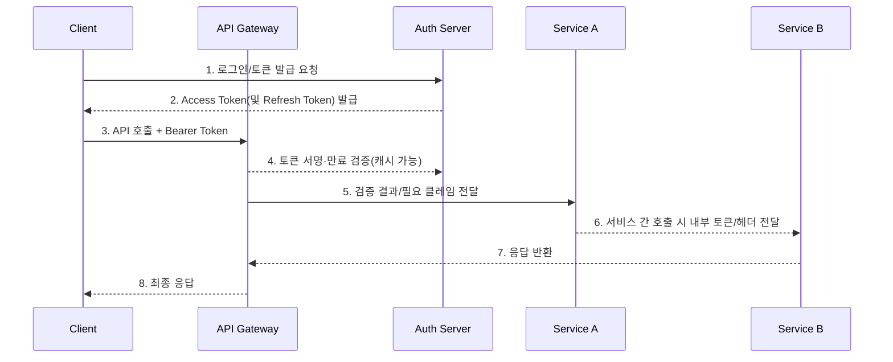

# 보안 강화를 위한 방법 
기본적인 ID/PW 검증 외에, 실무에서 보안 강화를 위해 반드시 추가해야 하는 기술적 조치들을 **데이터 저장, 통신, 인증 절차, 모니터링** 4가지 단계로 나누어 상세히 설명해 드리겠습니다.
---

### 1. 데이터 저장 단계: "털려도 못 읽게 만든다"
데이터베이스(DB)가 해킹당하더라도 비밀번호 원본을 절대 알 수 없도록 해야 합니다.

* **솔트(Salt)와 키 스트레칭(Key Stretching) 적용:**
    * 단순 해시(SHA-256 등)만 사용하면 '레인보우 테이블(미리 계산된 해시 값 표)' 공격에 취약합니다.
    * **구현:** 사용자의 비밀번호 앞뒤에 무작위 문자열(Salt)을 붙이고, 해시 함수를 수천 번 반복(Key Stretching)하여 연산 속도를 늦춥니다.
    * **추천 알고리즘:** `PBKDF2`, `Bcrypt`, **`Argon2`** (현재 가장 권장됨, 메모리 기반 공격 방어).

* **개인정보 암호화 저장:**
    * 비밀번호 외에 주민등록번호, 전화번호, 이메일 등 식별 가능한 정보(PII)는 **AES-256** 같은 양방향 암호화 알고리즘으로 암호화하여 저장해야 합니다.

### 2. 통신 및 세션 단계: "훔쳐 가도 못 쓰게 만든다"
로그인 후 발급된 토큰이나 세션 ID를 탈취당하는 것을 방지합니다.

* **JWT 저장소 분리 및 보안 플래그 설정:**
    * 액세스 토큰(Access Token)을 브라우저의 `LocalStorage`에 저장하면 XSS(스크립트 삽입) 공격에 취약해집니다.
    * **구현:** 리프레시 토큰(Refresh Token)은 **`HttpOnly`** (자바스크립트 접근 불가), **`Secure`** (HTTPS만 허용), **`SameSite`** (CSRF 방지) 속성이 걸린 쿠키에 저장합니다.
    
* **RTR (Refresh Token Rotation, 리프레시 토큰을 매번 재발급해 탈취를 감지하는 기법):**
    * 리프레시 토큰조차 탈취될 수 있습니다.
    * **구현:** 리프레시 토큰을 **'일회용'**으로 만듭니다. 액세스 토큰을 갱신할 때마다 리프레시 토큰도 새로 발급하고, 이전에 사용된 리프레시 토큰으로 접근하면 **모든 토큰을 폐기**하고 강제 로그아웃 시킵니다.

* **HTTPS 강제 (HSTS):**
    * 모든 통신은 SSL/TLS로 암호화되어야 하며, 서버 설정에서 HSTS 헤더를 추가하여 브라우저가 강제로 HTTPS로만 접속하도록 만듭니다.

### 3. 인증 절차 단계: "진짜 본인인지 두 번 묻는다"
ID/PW가 털렸을 때를 대비한 추가 방어막입니다.

* **MFA (Multi-Factor Authentication, 다중 요소 인증):**
    * "아는 것(비밀번호)" 외에 "가진 것(휴대폰, OTP)"이나 "생체 정보(지문)"를 요구합니다.
    * **구현:**
        * **TOTP:** Google Authenticator 같은 시간 기반 일회용 코드 (문자 메시지보다 보안성 높음).
        * **WebAuthn (Passkey):** 지문이나 FaceID를 이용한 비밀번호 없는 로그인 표준.

[Image of multi-factor authentication workflow]

* **비밀번호 복잡도 및 유효성 검사:**
    * 단순 길이 제한뿐만 아니라, `zxcvbn` 같은 라이브러리를 사용하여 **비밀번호의 엔트로피(예측 불가능성)**를 체크합니다. (예: "password123" 같은 흔한 패턴 차단)

### 4. 방어 및 모니터링 단계: "공격을 감지하고 차단한다"
비정상적인 접근 시도를 실시간으로 막아야 합니다.

* **Rate Limiting (속도 제한):**
    * 특정 IP나 ID에서 짧은 시간 동안 너무 많은 로그인 시도가 들어오면 차단합니다. (Brute Force 공격 방지)
    * **구현:** Redis 등을 활용해 '5분 내 5회 실패 시 30분 잠금' 같은 로직을 적용합니다.

* **Credential Stuffing 방지:**
    * 해커들이 다른 사이트에서 털린 ID/PW 목록을 무작위로 대입하는 공격을 막아야 합니다.
    * **구현:** CAPTCHA(봇 방지)를 로그인 실패 시 띄우거나, 평소 접속하지 않는 국가/기기에서 로그인 시도 시 **이메일 인증**을 추가로 요구합니다.

* **Impossible Travel (불가능한 이동) 탐지:**
    * 서울에서 로그인한 지 10분 만에 뉴욕에서 로그인이 시도되면 즉시 차단하는 로직입니다.

### 요약: 보안 강화 체크리스트

| 구분 | 필수 적용 기술 | 난이도 | 효과 |
| :--- | :--- | :--- | :--- |
| **암호화** | **Argon2** 또는 **Bcrypt** + Salt | 중 | 비밀번호 복호화 불가 |
| **토큰** | **HttpOnly Cookie** + **RTR(Refresh Token Rotation)** | 중 | XSS 방지 및 토큰 탈취 피해 최소화 |
| **추가 인증** | **MFA (OTP/SMS)** | 상 | 계정 탈취 99% 방어 |
| **방어** | **Rate Limiting** (로그인 시도 제한) | 하 | 무차별 대입 공격 무력화 |

이 중에서도 **Salt를 적용한 강력한 해시 알고리즘(Argon2)** 사용과 **MFA(2단계 인증) 도입**이 보안성을 가장 비약적으로 높여주는 방법입니다.

요청하신 **양방향/단방향 암호화의 개념**과, **토큰 탈취 대비책**, 그리고 **Cloudflare의 역할**에 대해 명쾌하게 설명해 드리겠습니다.

---

### 1. 양방향 암호화 vs 단방향 암호화

이 둘의 가장 큰 차이는 **"다시 원래대로 되돌릴 수 있는가?(복호화)"**입니다.

#### 🔒 양방향 암호화 (Two-way Encryption)
* **개념:** 암호화된 데이터를 **키(Key)를 사용해 다시 원본 데이터로 되돌릴 수 있는** 방식입니다.
* **비유:** **자물쇠가 달린 보물상자**입니다. 열쇠로 잠그면(암호화) 아무도 못 보지만, 열쇠가 있으면 다시 열어서(복호화) 내용을 볼 수 있습니다.
* **사용 예시:**
    * **전화번호, 주소, 계좌번호:** 서비스 운영자가 택배를 보내거나 정산을 해주려면 이 정보를 다시 눈으로 확인해야 하죠? 그래서 관리자가 키를 갖고 풀어볼 수 있게 양방향으로 저장합니다.
    * **기술:** AES-256 (가장 많이 씀), RSA.

#### 🛡️ 단방향 암호화 (One-way Encryption)
* **개념:** 한 번 암호화하면 **절대로 다시 원본으로 되돌릴 수 없는** 방식입니다. (수학적으로 불가능하게 설계됨)
* **비유:** **믹서기에 넣고 갈아버린 고기**입니다. 고기를 갈아서 햄버거 패티(암호문)를 만들 수는 있지만, 패티를 다시 원래의 고기 덩어리로 되돌릴 수는 없습니다.
* **사용 예시:**
    * **비밀번호:** 비밀번호는 개발자나 DB 관리자도 알면 안 됩니다. 사용자가 로그인할 때 입력한 값도 똑같이 '믹서기'에 갈아서, DB에 저장된 '갈린 결과물(해시값)'끼리 비교만 합니다.
    * **기술:** SHA-256, Bcrypt, Argon2.

---

#### 🔐 암호화/복호화 과정 상세 (인코딩/디코딩)

데이터가 어떻게 변환되고 다시 원래대로 돌아오는지 그 과정을 좀 더 자세히 살펴보겠습니다.

##### 1. 단방향 암호화 (해싱) 과정: 인코딩만 가능, 디코딩 불가
단방향 암호화는 데이터를 특정 알고리즘과 함수를 통해 고정된 길이의 **해시값(Hash Value)**으로 변환하는 과정입니다. 이 해시값은 원본 데이터의 '지문'과 같습니다.

*   **인코딩 (해싱):**
    *   **입력:** 원본 비밀번호 (`"mysecretpassword"`)
    *   **알고리즘:** SHA-256, Bcrypt, Argon2 등
    *   **과정:**
        1.  원본 비밀번호를 입력받습니다.
        2.  선택적으로 `솔트(Salt)`라는 무작위 값을 비밀번호에 추가하여 입력값의 복잡성을 높입니다. (레인보우 테이블 공격 방어)
        3.  지정된 해시 알고리즘(`Bcrypt` 등)을 사용하여 비밀번호 + 솔트를 반복적으로 연산합니다. (키 스트레칭)
        4.  최종적으로 고정된 길이의 고유한 해시값이 출력됩니다.
    *   **출력:** 해시값 (`"$2a$10$abcdefghijklmnopqrstuvwxyz1234567890abcdef.abcdef"`)
    *   **특징:** 동일한 입력값은 항상 동일한 해시값을 생성하지만, 해시값만으로 원본 입력값을 역추적하는 것은 수학적으로 불가능합니다. 아주 작은 원본값의 변화도 전혀 다른 해시값을 만듭니다.

*   **디코딩:** 불가능합니다. (원본으로 되돌릴 수 없음)

##### 2. 양방향 암호화/복호화 과정: 인코딩 및 디코딩 가능

양방향 암호화는 데이터를 암호화 키를 이용해 암호문으로 변환하고, 다시 복호화 키를 이용해 원본 데이터로 되돌릴 수 있는 과정입니다.

*   **인코딩 (암호화):**
    *   **입력:** 원본 데이터 (`"010-1234-5678"`)
    *   **알고리즘:** AES-256 등
    *   **과정:**
        1.  원본 데이터를 입력받습니다.
        2.  `암호화 키(Encryption Key)`와 함께 암호화 알고리즘을 적용합니다.
        3.  때로는 `IV(Initialization Vector)` 같은 추가적인 무작위 값을 사용해 암호화 패턴의 예측 가능성을 낮춥니다.
        4.  최종적으로 암호화된 데이터(암호문)가 출력됩니다.
    *   **출력:** 암호문 (`"jkl2o3ij12o3i12j3o12j3o1j23o1j23o1j23o1j23o1j23o"`)
    *   **특징:** 암호화 키를 모르면 암호문을 해독할 수 없습니다.

*   **디코딩 (복호화):**
    *   **입력:** 암호문 (`"jkl2o3ij12o3i12j3o12j3o1j23o1j23o1j23o1j23o1j23o"`)
    *   **알고리즘:** AES-256 등 (암호화와 동일)
    *   **과정:**
        1.  암호화된 데이터를 입력받습니다.
        2.  **동일한 `복호화 키(Decryption Key)`** (대칭키 방식) 또는 **쌍으로 된 `개인 키(Private Key)`** (비대칭키 방식)와 함께 복호화 알고리즘을 적용합니다.
        3.  원래의 데이터로 되돌립니다.
    *   **출력:** 원본 데이터 (`"010-1234-5678"`)
    *   **특징:** 올바른 복호화 키가 없으면 암호문을 원래대로 되돌릴 수 없습니다. 키의 안전한 관리가 매우 중요합니다.

이러한 암호화/복호화 메커니즘을 이해하는 것이 데이터 보안 설계의 핵심입니다.

---

### 2. 토큰이 탈취당했는지 모를 때를 대비한 방어책

해커가 내 토큰을 훔쳐 갔지만, **아직 아무 짓도 안 해서 우리가 모르는 상황**이 가장 위험합니다. 이를 대비해 **"훔쳐 가도 쓸모없게 만드는"** 전략을 씁니다.

#### ① 액세스 토큰의 수명을 아주 짧게 설정 (Short-lived Access Token)
* **방법:** 액세스 토큰의 유효 시간을 **30분~1시간**으로 짧게 잡습니다.
* **효과:** 해커가 토큰을 훔쳐도, 30분 뒤에는 만료되어 쓰레기가 됩니다. 해커 입장에서는 공격할 시간이 부족해집니다.

#### ② 리프레시 토큰 로테이션 (RTR - Refresh Token Rotation, 이전 토큰을 즉시 폐기하는 구조)
* **방법:** 토큰을 갱신(Refresh)할 때마다 **리프레시 토큰도 새로 발급**하고, 이전 리프레시 토큰은 즉시 폐기합니다.
* **핵심 시나리오:**
    1.  해커가 리프레시 토큰(A)을 훔침.
    2.  진짜 사용자도 토큰 갱신을 시도 (A → B로 교체됨).
    3.  나중에 해커가 훔친 토큰(A)을 쓰려고 시도.
    4.  서버: "어? A는 이미 사용되고 버려진 토큰인데 누가 또 쓰네?" → **토큰 탈취로 간주.**
    5.  **조치:** 해당 유저의 **모든 토큰(A, B 포함 전부)을 강제 만료**시키고 다시 로그인하게 만듭니다.

#### ③ 환경 정보 바인딩 (Client Fingerprinting)
* **방법:** 토큰을 발급할 때 사용자의 **IP 주소**나 **브라우저 정보(User-Agent)**를 함께 기록해 둡니다.
* **효과:** 한국(IP)에서 발급된 토큰이 갑자기 러시아(IP)에서 요청을 보내면, 토큰이 유효하더라도 요청을 거부합니다.

---

### 3. Cloudflare(클라우드플레어)를 쓰면 대체되는 것들

Cloudflare는 우리 서버 **앞단**에 서서 들어오는 트래픽을 먼저 검사하는 **경비원(Proxy)** 역할을 합니다. 앞서 설명한 보안 조치 중 **'네트워크/인프라'** 레벨의 기능들을 아주 강력하게 대체해 줍니다.

| 구분 | Cloudflare가 대체/강화해 주는 것 ✅ | Cloudflare가 못하는 것 (개발자가 해야 함) ❌ |
| :--- | :--- | :--- |
| **DDoS 방어** | **완벽 대체.** Rate Limiting(요청 속도 제한)을 서버 코드 없이 클릭 몇 번으로 설정 가능. | - |
| **HTTPS** | **대체.** 서버에 복잡하게 인증서를 설치하지 않아도, Cloudflare가 무료로 SSL/HTTPS를 적용해 줌. | - |
| **봇 차단** | **대체.** `Credential Stuffing`(무차별 대입)이나 매크로 봇을 자동으로 감지하고 차단함 (WAF). | - |
| **로그인 보안** | 비정상적인 국가 접속 차단 (Geo-blocking). | **DB 암호화:** 비밀번호를 해싱(단방향 암호화)하여 DB에 저장하는 건 **개발자**가 코드에서 해야 함. |
| **토큰 관리** | - | **토큰 로직:** JWT 발급, 만료 시간 설정, RTR(Refresh Token Rotation) 구현 등은 **애플리케이션 로직**이므로 직접 개발해야 함. |
| **인증** | Cloudflare Access(Zero Trust) 사용 시 일부 대체 가능하나 일반적으론 보조 수단. | **2단계 인증(MFA):** OTP 검증 등의 로직은 직접 구현해야 함. |

**요약하자면:**
* **Cloudflare:** "우리 집 대문 앞을 지키는 경비업체" (도둑, 깡패, 잡상인 차단)
* **개발자(직접 구현):** "집 안 금고의 잠금장치" (비밀번호 암호화, 토큰 관리, OTP)

따라서 Cloudflare를 쓰더라도 **비밀번호 단방향 암호화**나 **토큰 관리 로직(RTR, Refresh Token Rotation)**은 반드시 직접 구현해야 합니다.
### 세션 인증과 JWT 토큰 인증 비교

| 구분 | 세션 인증 | JWT 토큰 인증 |
| :--- | :--- | :--- |
| **상태 저장 위치** | 서버가 세션 스토어에 상태를 유지하므로 쿠키에는 식별자만 담김. | 토큰 자체가 인증 정보를 포함해 클라이언트가 전부 보관. |
| **다중 서버/확장성** | 세션 공유(Sticky Session, Redis 등)가 필요해 인프라 구성이 복잡. | 무상태(stateless)라 로드밸런싱, 멀티 서버, 멀티 지역 확장이 쉬움. |
| **보안 제어** | 서버에서 언제든 세션을 무효화할 수 있고 쿠키 속성으로 CSRF 방어가 용이. | 서명만 검증하면 되지만 토큰이 유출되면 만료까지 계속 사용 가능해 RTR(Refresh Token Rotation)·짧은 만료 등 보완 필요. |
| **만료/로그아웃 처리** | 서버 세션 삭제로 즉시 전파 가능. | 이미 발급된 토큰은 만료 시간이 오기 전까지 직접 회수하기 어려움. |
| **네트워크 효율** | 요청마다 쿠키에 세션 ID만 전송하므로 상대적으로 가벼움. | 토큰에 클레임이 많을수록 요청 페이로드가 커짐. |
| **모바일·외부 연동** | 브라우저 쿠키 기반이라 모바일/백엔드 간 연동 시 별도 처리가 필요. | 도메인 간, 모바일 앱, 외부 API 연동이 편리하고 인증 서버·리소스 서버 분리가 쉬움. |

#### 세션 스토어 운용 흐름 예시
1. 사용자가 로그인하면 서버가 세션 ID(난수)를 생성하고 세션 스토어(예: Redis)에 `세션ID -> 사용자 정보/권한`을 저장합니다.
2. 브라우저에는 세션 ID만 쿠키로 내려보내고, 이후 요청마다 그 쿠키가 자동으로 첨부됩니다.
3. 다중 서버 환경에선 모든 서버가 같은 세션 스토어를 바라보므로, 어떤 서버가 요청을 받더라도 세션 ID로 상태를 조회할 수 있습니다.
4. 로그아웃이나 만료 처리는 세션 스토어에서 해당 키를 삭제하면 즉시 모든 서버에 반영됩니다.

#### JWT 토큰 인증 운용 흐름 예시
1. 로그인 성공 시 서버가 사용자 식별자·권한·만료 시간 등의 클레임을 담은 JWT를 서명(secret 또는 private key)하고, 액세스 토큰과 리프레시 토큰을 함께 발급합니다.
2. 클라이언트는 액세스 토큰을 `Authorization: Bearer <token>` 헤더 등으로 매 요청마다 전송하고, 서버는 토큰 서명과 만료 시간을 검증해 별도 조회 없이 권한을 판별합니다.
3. 액세스 토큰이 만료되면 클라이언트가 리프레시 토큰으로 `/token/refresh` 같은 엔드포인트를 호출하고, 서버는 RTR(Refresh Token Rotation) 정책에 따라 새 토큰 쌍을 발급하며 이전 리프레시 토큰을 폐기합니다.
4. 토큰 탈취 탐지를 위해 IP(요청 발신지의 인터넷 주소)·UA(User-Agent, 브라우저/디바이스 정보) 같은 메타데이터를 동시에 저장하거나, 토큰 블랙리스트/화이트리스트를 운영해 강제 로그아웃 시 해당 토큰을 즉시 차단합니다.

#### MSA 환경의 토큰 인증 흐름 (Mermaid)

**내부 서비스 통신 보안 계층(mTLS/서비스 메시)**
- **mTLS(mutual TLS):** 서비스 A와 B가 TLS 핸드셰이크 과정에서 서로 인증서를 제시·검증해 상호 신뢰를 확보합니다. 내부 PKI나 SPIFFE/SPIRE 같은 시스템이 인증서 발급·회전을 자동화해 주므로 코드 수정 없이 전 서비스 간 암호화·상호 인증이 적용됩니다.
- **서비스 메시(Istio, Linkerd 등):** 모든 Pod/컨테이너 앞뒤에 사이드카 프록시를 붙여 트래픽을 가로채고, 중앙 제어 플레인에서 mTLS 정책·암호화·접근 제어를 일괄 관리합니다. 메시가 호출자 아이덴티티를 헤더(SVID 등)로 전달하므로 다운스트림 서비스가 추가 토큰 없이도 호출 주체를 검증하거나, 필요 시 내부용 JWT 발급·검증 정책을 적용할 수 있습니다.
